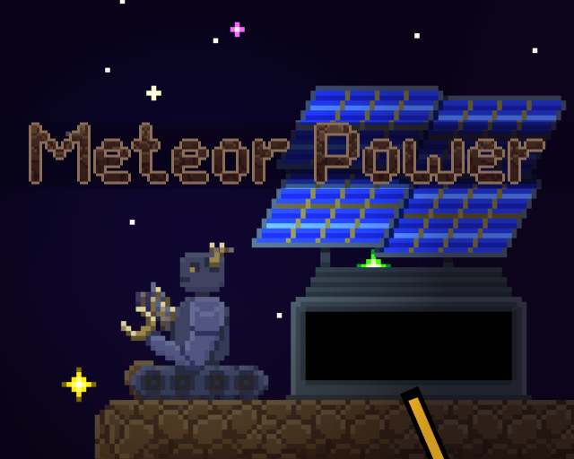
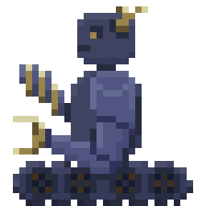

# Meteor Power

> _**[Play the game!](https://levi.dev/meteor_power)**_
> 
> _**[Watch a gameplay video!](https://levi.dev/meteor_power)**_
> 
> _**[Checkout the original Ludum Dare version!](https://ldjam.com/events/ludum-dare/50/meteor-power)**_

  

> ☄️🤖 A point-and-click AI platformer: Build solar stations, connect power, avoid meteors!

## 💿 Software used

-   **[Godot](https://godotengine.org/):** Game engine.
-   **[Piskel](https://www.piskelapp.com/user/5663844106502144):** Pixel-art image editor.
-   **[Aseprite](https://www.aseprite.org/):** Pixel-art image editor.
-   **[Bfxr](https://www.bfxr.net/):** Sound effects editor.
-   **[DefleMask](https://deflemask.com/):** Chiptune music tracker.
-   **[Surfacer](https://godotengine.org/asset-library/asset/968):** Framework for procedural path-finding across 2D platforms.
-   **[Scaffolder](https://godotengine.org/asset-library/asset/969):** Framework for general app and UI infrastructure.
-   **[SurfaceTiler](https://github.com/SnoringCatGames/surface_tiler):** Framework for "next-level" autotiling.

## ⚙️ Getting set up

> **NOTE:** This repo uses [Git submodules](https://git-scm.com/book/en/v2/Git-Tools-Submodules) to include frameworks.

To learn more about how the code works, checkout the [Surfacer](https://github.com/SnoringCatGames/surfacer/) and [Scaffolder](https://github.com/SnoringCatGames/scaffolder/) READMEs.

## 📃 Licenses

-   All code is published under the [MIT license](LICENSE).
-   All art assets (files under `assets/images/`, `assets/music/`, and `assets/sounds/`) are published under the [CC0 1.0 Universal license](https://creativecommons.org/publicdomain/zero/1.0/deed.en).
-   This project depends on various pieces of third-party code that are licensed separately. Here are lists of these third-party licenses:
    -   [addons/scaffolder/src/config/scaffolder_third_party_licenses.gd](https://github.com/SnoringCatGames/scaffolder/blob/master/src/config/scaffolder_third_party_licenses.gd)
    -   [addons/surfacer/src/config/surfacer_third_party_licenses.gd](https://github.com/SnoringCatGames/surfacer/blob/master/src/config/surfacer_third_party_licenses.gd)
    -   [src/config/third_party_licenses.gd](./src/config/third_party_licenses.gd)

  

